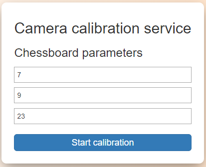
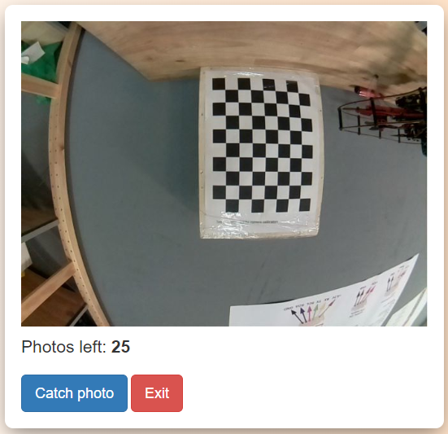
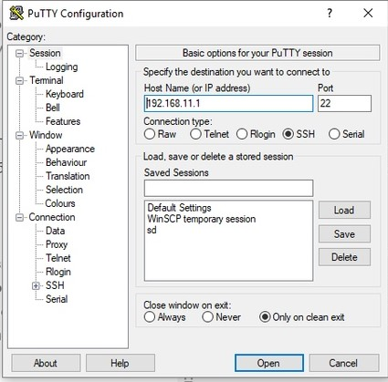
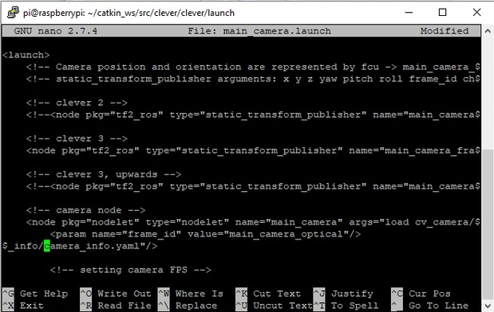

# Калибровка камеры

Для точной работы систем компьютерного зрения (например, для навигации по ArUco-маркерам) используемая камера должна быть откалибрована.  


> Изображение "скруглено" ближе к краям.
Какой-либо алгоритм компьютерного зрения будет воспринимать информацию с этой картинки неправильно.

## Установка приложения

Для начала, необходимо установить необходимые библиотеки:

```bash
pip install numpy  
pip install opencv-python  
pip install pyyaml  
pip install urllib2
pip install flask, flask-wtf
```

Затем скачиваем исходный код из репозитория и проводим установку:

```bash
git clone https://github.com/tinderad/calibration_web_2.7.git
cd calibration_web_2.7.git
sudo python setup.py build
sudo python setup.py install
```

## Подготовка к калибровке

Вам необходимо подготовить калибровочную мишень. Она представляет собой «шахматную доску». Файл можно взять [отсюда](https://www.oreilly.com/library/view/learning-opencv-3/9781491937983/assets/lcv3_ac01.png).  
Наклейте распечатанную мишень на любую твердую поверхность. Посчитайте количество пересечений в длину и в ширину доски, измерьте размер клетки (в мм), как указано на изображении.


Включите Клевер и подключитесь к его Wifi.

> Перейдите на _192.168.11.1:8080_ и проверьте, получает ли компьютер изображения из топика _image_raw_.

## Калибровка

Подключитесь к Клеверу по протоколу SSH (например, при помощи PuTTY).

Запустите приложение:

```bash
>cd calibration_web_2.7/ccc_server
>python app.py
```

Далее вам необходимо на компьютере открыть в браузере страницу по адресу _192.168.11.1:8081_

> Порт можно настроить в файле _ccc_server/config.py_.

На открытой странице необходимо ввести параметры калибровочной мишени: количество перекрестий в длину и ширину, длину ребра квадрата. Для начала калибровки нажмите кнопку  **_Start Calibration_**.



На следующей странице при помощи кнопки **_Catch photo_** можно делать фотографии калибровочной мишени.



Если программа нашла на изображении указанную мишень, откроется страница, на которой вам необходимо подтвердить корректность найденных перекрестий.

Если перекрестия были распознаныы правильно, нажмите на клавишу **_Add photo_**, и перейдите к получению новых фотографий. В противном же случае, ели перекристия были распознаны некорректно, пропустите данную фотографию при помощи клавиши **_Skip_**.

>В большинстве случаев найденные углы будут подсвечиваться разными цветами, но иногда подсветка будет становиться красной. это происходит в том случае, если углы распознаны, но неточно.

Чтобы откалибровать камеру, вам требуется сделать как минимум 25 фото шахматной доски с различных ракурсов. После преодоления данного порога появится кнопка **_Finish_**, по нажатию на которую начнется генерация калибровочного файла.

>Это может занять некоторое время.

На открывшейся странице выведется информация о результате калибровки: имя файла и re-projection error.
>re-projection error - отклонение от стандартной математической модели. Чем эта величина меньше, тем точнее проведена калибровка.


Программа обработает все полученные фотографии, и создаст **_.yaml_** файл в нынешней директории. При помощи этого файла можно будет выравнивать искажения на изображениях, полученных с этой камеры.

> Если вы поменяете разрешение получаемого изображения, вам нужно будет снова калибровать камеру.

## Предыдущая версия

Также вы можете воспользоваться предыдущей версией программы, не имеющей web-интерфейса.

Запустите скрипт **_calibrate_cam_**:

```bash
>calibrate_cam
```

Задайте параметры мишени:

```bash
>calibrate_cam
Chessboard width:  # Перекрестий в ширину
Chessboard height:  # Перекрестий в длину
Square size:  # Длина ребра клетки (в мм)
Saving mode (YES - on):  # Режим сохранения
```

> Режим сохранения: если включен, то все полученные фотографии будут сохраняться в нынешней директории.

Скрипт начнет свою работу:

```
Calibration started!
Commands:
help, catch (key: Enter), delete, restart, stop, finish
```

Чтобы откалибровать камеру, вам требуется сделать как минимум 25 фото шахматной доски с различных ракурсов.

Чтобы сделать фото, введите команду **_catch_**.

```bash
>catch
```

Программа будет информировать вас о состоянии калибровки.

```bash
...
Chessboard not found, now 0 (25 required)
>  # Enter
---
Image added, now 1 (25 required)
```

> Вместо того, чтобы каждый раз вводить команду **_catch_**, Вы можете просто нажимать клавишу **_Enter_** (вводить пустую строку).

После того, как будет набрано достаточное количество изображений, введите команду **_finish_**.

```bash
...
>finish
Calibration successful!
```

**Калибровка по существующим изображениям:**

Если же у вас уже есть изображения, то вы можете откалибровать камеру по ним при помощи скрипта **_calibrate_from_dir_**.

```bash
>calibrate_from_dir
```

Указываем характеристики мишени, а так же путь до папки с изображениями:

```bash
>calibrate_cam_ex
Chessboard width:  # Перекрестий в ширину
Chessboard height:  # Перекрестий в длину
Square size:  # Длина ребра клетки (в мм)
Path:  # Путь до папки с изображениями
```

В остальном этот скрипт работает аналогично **_calibrate_cam_**.

Программа обработает все полученные фотографии, и создаст файл **_camera_info_****_._****_yaml_** в нынешней директории. При помощи этого файла можно будет выравнивать искажения на изображениях, полученных с этой камеры.

## Исправление искажений

За получение исправленного изображения отвечает функция
**clever_cam_calibration._get_undistorted_image(cv2_image, camera_info)_**:

* **_cv2_image_**: Закодированное в массив cv2 изображение.
* **_camera_****_­__****_info_**: Путь до файла калибровки.

Функция возвращает массив cv2, в котором закодировано исправленное изображение.

> Если вы используете fisheye-камеру, поставляемую вместе с Клевером, то для обработки изображений разрешением 320x240 или 640x480 вы можете использовать уже существующие параметры калибровки. Для этого в качестве аргумента **_camera_info_** передайте параметры **_clever_cam_calibration.CLEVER_FISHEYE_CAM_320_** или **_clever_cam_calibration.CLEVER_FISHEYE_CAM_640_** соответственно.

## Примеры работы

Изначальные изображения:


Иcправленные изображения:


## Пример использования

**Обработка потока изображений с камеры**.

Данная программа получает изображения с камеры Клевера и выводит их на экран в исправленном виде, используя существующий калибровочный файл.

```python
import clever_cam_calibration as ccc  
import cv2  
import urllib.request  
import numpy as np  
while True:  
	req = urllib.request.urlopen('http://192.168.11.1:8080/snapshot?topic=/main_camera/image_raw')  
    arr = np.asarray(bytearray(req.read()), dtype=np.uint8)  
    image = cv2.imdecode(arr, -1)  
    undistorted_img = ccc.get_undistorted_image(image, ccc.CLEVER_FISHEYE_CAM_640)  
    cv2.imshow("undistort", undistorted_img)  
    cv2.waitKey(33)  
cv2.destroyAllWindows()
```

## Использование для ArUco

Чтобы применить параметры калибровки к системе ArUco-навигации, требуется перенести калибровочный .yaml файл на Raspberry Pi Клевера и инициализировать его.

> Не забудьте подключиться к WiFI Клевера.
Для передачи файла используется протокол SFTP. В данном примере используется программа WinSCP.

Подключимся к Raspberry Pi по SFTP:

> Пароль: _**raspberry**_


Нажимаем “Войти”. Переходим в _**/home/pi/catkin_ws/src/clever/clever/camera_info/**_ и копируем туда калибровочный .yaml файл:


Теперь мы должны выбрать этот файл в конфигурации ArUco. Для этого используется связь по протоколу SSH. В данном примере используется программа PuTTY.

Подключимся к Raspberry Pi по SSH:



Войдем под логином _**pi**_ и паролем _**raspberry**_, перейдем в директорию _**/home/pi/catkin_ws/src/clever/clever/launch**_ и начнем редактировать конфигурацию _**main_camera.launch**_:


В строке _**camera node**_ заменим параметр _**camera_info**_ на _**camera_info.yaml**_:



> Не забудьте изменить разрешение камеры в *main_camera.launch*.
